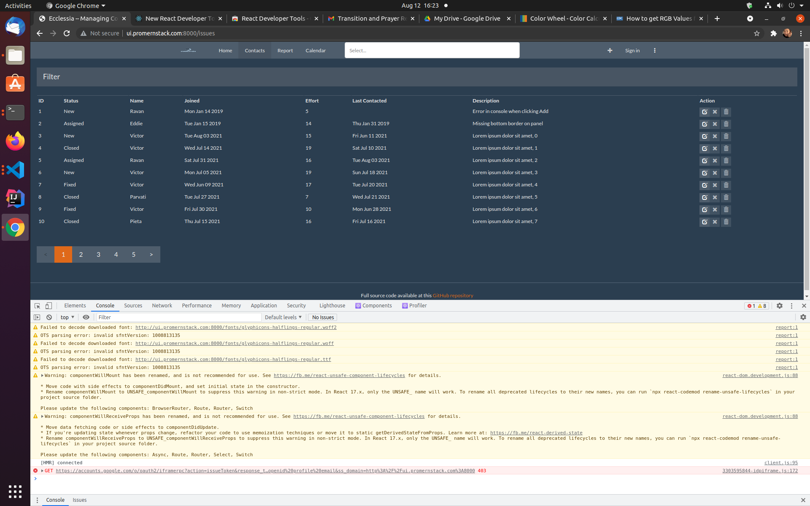

# EcclesiaWebApp
CRM Application modified for Churches and Non-Profits using the MERN Stack

Source Code: https://github.com/samk901/EcclesiaWebApp  

Application UI: https://ecclesia-ui-samk901.herokuapp.com/  

(Please note, for some reason, the app is buggy on Firefox, still working on a solution.)  

## Iter 2

In this iteration, we added some styles in addition to the standard Bootstrap CSS using a template available online. We also added a Homepage that will serve as our landing page and adapted the routing from the book project. We also began implementing a Calendar Component using React-Calendar, which will allow a user to keep track of meetings. The next step is to continue implementing the calendar, implement a Reading List page and finish the homepage. 

## Iter 1

In this iteration the basic structure of our web application has been completed. I will be using the IssueTracker from Pro MERN to serve as working template. The primary CRUD operations have been adapted for the project to serve as a way for the user to maintain contact lists for this Customer Relationship Management (CRM) web application. 

Currently we have a placeholder for the Calendar page, but the plan is to implement a working Google Calendar, using their Calendar API. This iteration meets the users desire to have a working, deployed UI with basic CRUD operations. 

Also, the fields of the database and consequently its schema will need to be adapted for Contact information. 
